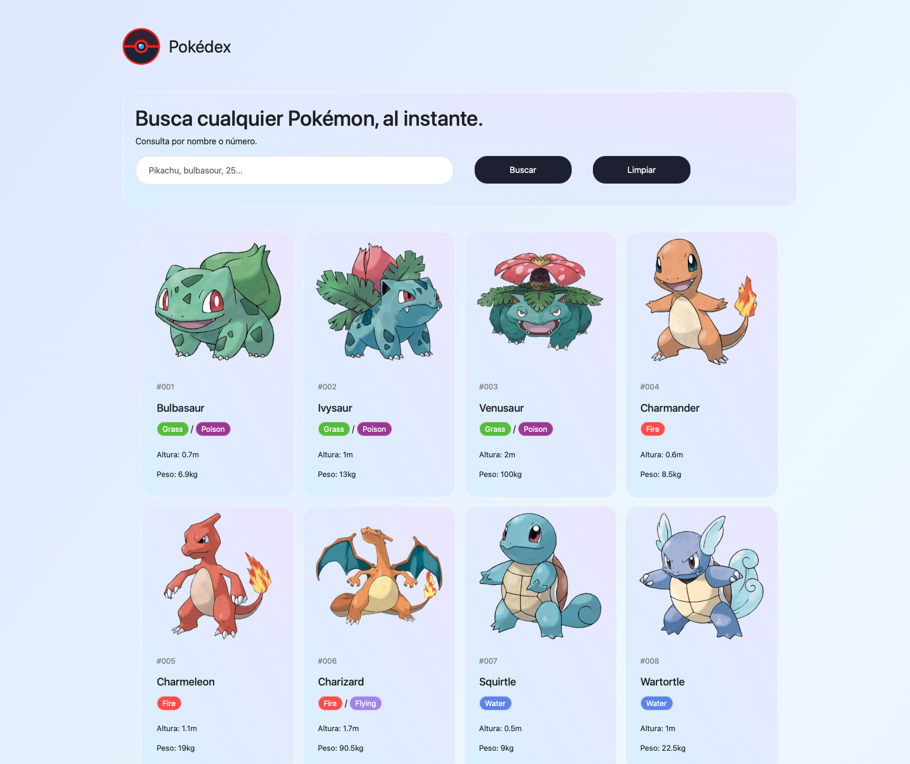

# Api Pokémon

**Alumno:** Nicolás Javier Agostino  
**Proyecto:** Api Pokémon

## Descripción

Proyecto académico que consiste en el desarrollo de una aplicación web para buscar Pokémon y visualizar su información mediante el consumo de PokéAPI.

## Captura de la aplicación

## Funcionalidades

- Búsqueda de Pokémon.
- Visualización de la imagen oficial, nombre e identificador.
- Identificación de los tipos mediante colores.
- Presentación de la altura en metros y el peso en kilogramos.

## Tecnologías utilizadas

- HTML
- CSS
- JavaScript
- Bootstrap
- PokéAPI

## Instrucciones de ejecución

1. Descargar o clonar el repositorio.
2. Abrir la carpeta del proyecto en Visual Studio Code.
3. Ejecutar el archivo `index.html` mediante la extensión Live Server.
4. Utilizar el buscador para consultar la información de un Pokémon.

Se requiere conexión a internet para obtener los datos y las imágenes.

## Fuente de datos

La información se obtiene de [PokéAPI](https://pokeapi.co/).